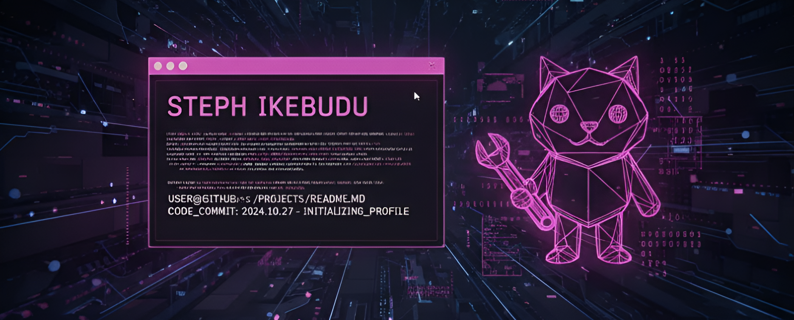

# 
Hi 👋🏽, I'm Steph Ikebudu!

  

  
  
  
  
  
  
  
  
  

  

 

  

 

I’m a software engineer who has turned my love for problem-solving into a full-time career. I currently have 3+ years of experience developing robust web applications end-to-end, from building modern, dynamic UIs to development, deployment and management of databases and other backend infrastructure that make applications functional as well as building the systems for deployment.

I enjoy volunteering in my free time and currently volunteer for [Google Developer Group Abuja](https://gdg.community.dev/gdg-abuja/), [Young Women Code](https://www.youngwomencode.org/) and [Nigerian Girl in STEM](https://www.instagram.com/nigeriangirlinstem/). I also love contributing to Open Source projects that interest me, I'm a project maintainer for [SinkedIn](https://www.sinkedin.app/) and regularly contribute to [YouTube Channel Directory](https://github.com/stephikebudu/Free-Official-Youtube-Content/tree/main). I'm passionate about personal development, currently I'm exploring technologies/specializations in data - I'm training my Python programming muscles by studying [Head First Python by Paul Barry](https://www.google.com.ng/books/edition/Head_First_Python/ycnSEAAAQBAJ?hl=en&gbpv=0) and solving problems.
  

   

## Life Lately

- 🌱 I’m working on navigating early careee successfully  
    
- ❓ I'm probably studying this very second
    
- ⚡ Fun fact: I've been self-learning French actively for 1+ year now and have attained basic conversational level in French Language🎉. Add me up on Duolingo [@stephikebudu](https://www.duolingo.com/profile/stephikebudu)

   

## Languages and Tools  

  
  
  
  
  
  
  
  
  
  
  
  
  
  
  
  
  
  
  
  
  
  
  
  
  
  
  
  
  
  
  
  
  
  
  
  
  
  
  

  

   

## Github Stats  

<table align="center"><tr><td valign="center" width="50%">

</td><td valign="center" width="50%">

</td></tr></table>  

   

  

   

  
  

   

 
